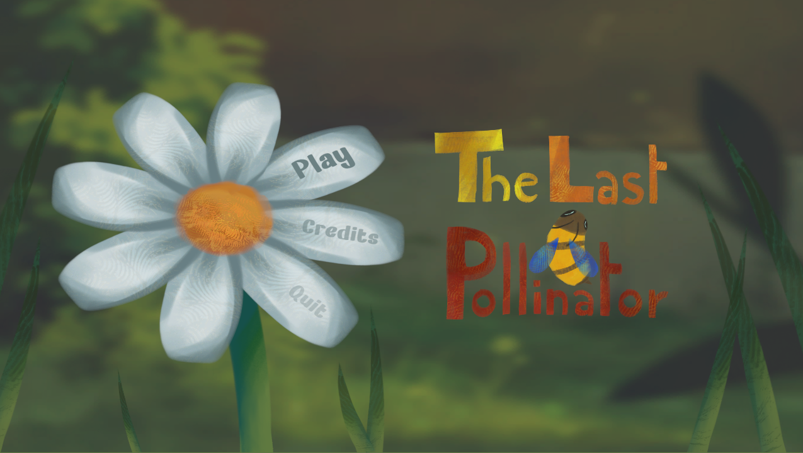
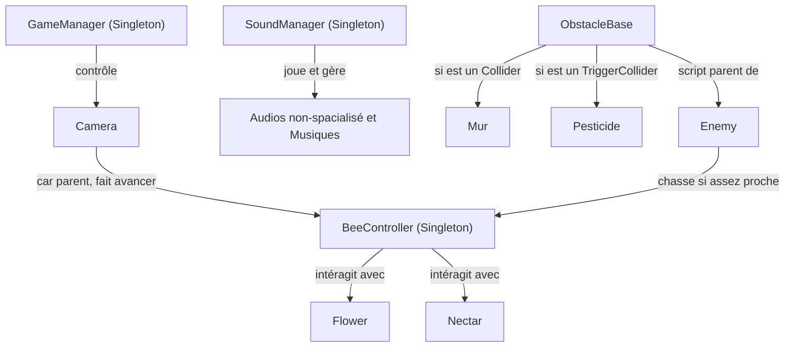
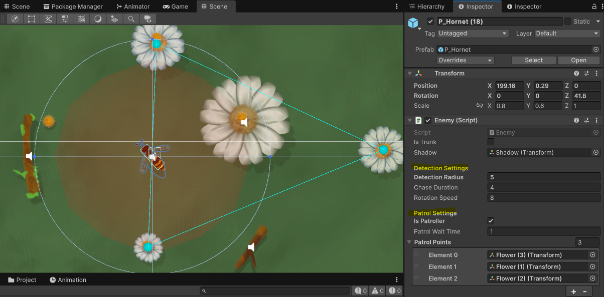
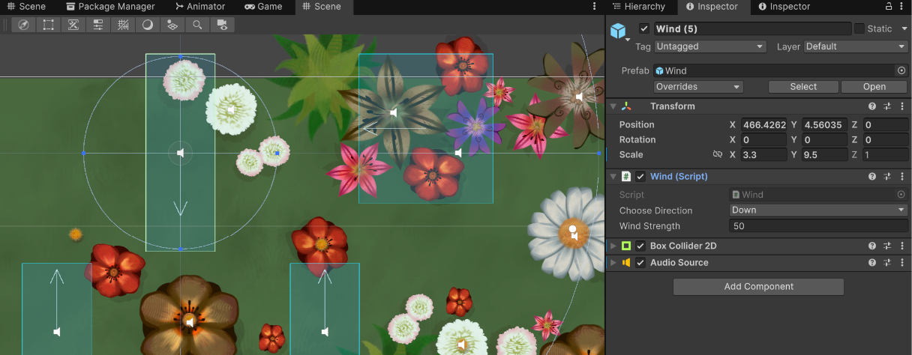
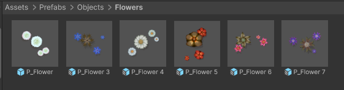
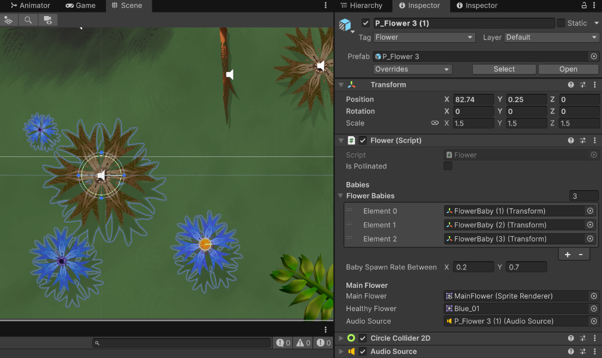

# The Last Pollinator - Documentation

### **Contexte du Projet :**

Petit jeu de sensibilisation écologique développé en un mois à l'occasion de la **Climate Game Jam 2026** organisée par l’**IndieCade**. 

Il s'agit d'un *runner* 2D en vue du dessus. Le joueur incarne une abeille sauvage qui doit survivre en évitant les pesticides, la faim, les prédateurs et d'autres dangers environnementaux, tout en pollinisant un maximum de fleurs sur son passage.

Jouer sur itch.io : [The Last Pollinator](https://opalyassia.itch.io/the-last-pollinator)

### **Utilisation de :**
- Unity 6.5
- Plugin NavMeshPlus : extension pour les déplacment sur un NavMesh 2D, car le système NavMesh d'Unity classique ne fonctionne pour les projets 3D. Ce plugin nous a permit de ne pas perdre du temps là dessus.
- Plugin DOTween : utilisé pour ajouter un maximum de juice de manière efficace, pour les feedback visuels et crossfades audio.

### **Scènes principales :**
- [Menu](Assets/Scenes/Menu.unity)
- [Gameplay](Assets/Scenes/Proto1.unity)

### **Comportement & mécanique principales**
- **Mouvement** : `BeeController` lit `InputAction` et applique des forces via `Rigidbody2D.AddForce`. Le corps et l'ombre sont animés avec DOTween (`DOLocalRotate`, `DOShakePosition`).
- **Énergie vitale** : une barre d'énergie diminue au fil du temps, récupérer du nectar restaure l'énergie et augmente un stock utilisable pour polliniser.
- **Pollinisation** : toucher une `Flower` non pollinisée et posséder au mopins 1 nectar déclenche `Flower.Pollinate()` (animations, sons, spawn de baby-flowers).
- **Obstacles** : `ObstacleBase` gère dégâts/déplacements; `Enemy` étend la logique (NavMeshAgent 2D, états Patrol/Chase/Return), déclenche sons via `SoundManager`.
- **Son**: `SoundManager` orchestre musique ambiante, chase music et effets sonores (crossfades, boucles).
- **Optimisation** : `Optimizer` active/désactive lumières et particules sur la base d'un trigger (layer `Temporary`) pour réduire la charge.

### **Architecture - Vue d'ensemble**

### **Scripts clés et leur rôle :**
- [Scripts/Managers/MenuManager.cs/](Assets/Scripts/Managers/MenuManager.cs) : Script principal du Menu.
- [Scripts/Managers/GameManager.cs](Assets/Scripts/Managers/GameManager.cs) : progression du niveau (défilement caméra), vie/fin de partie avec lancement de l'écran de victoire ou gameover.
- [Scripts/BeeController.cs](Assets/Scripts/BeeController.cs) : Script joueur, gestions des inputs in game, controller(Rigidbody2D), gestion énergie vitale de l'abeille.
- [Scripts/Flower.cs](Assets/Scripts/Flower.cs): logique de pollinisation, animation d'apparition des bébé fleurs, feedbacks sonores.
- [Scripts/Obstacles/Enemy.cs](Assets/Scripts/Obstacles/Enemy.cs) : ennemi frelon avec navmesh agent, états (Patrol/Chase/Return), logique de poursuite.
- [Scripts/Obstacles/ObstacleBase.cs](Assets/Scripts/Obstacles/ObstacleBase.cs) : base pour les obstacles, réactions collision/trigger. (Peut être un obstacle ou un pesticide en fonction de si le collider est un trigger ou pas.)
- [Scripts/Managers/SoundManager.cs](Assets/Scripts/Managers/SoundManager.cs) : gestion musiques, effets sonores poncuels, crossfades et routines de lecture. A l'exeption du joueur et ces enemies (les objets avec un comporement plus complexes) qui gèrent leurs propres sons sans passer par le SoundManager.
- [Scripts/Optimizer.cs](Assets/Scripts/Optimizer.cs) : activation/désactivation runtime d'éléments temporaires (notemment les lights et particles) pour optimiser les perf en WebGL.
- UI : [Scripts/UI/GameOverUI.cs](Scripts/UI/GameOverUI.cs), [Scripts/UI/VictoryUI.cs](Assets/Scripts/UI/VictoryUI.cs), [Scripts/UI/PetalButton.cs](Assets/Scripts/UI/PetalButton.cs).

### **Méthodes importantes**
- `BeeController`:
  - `public void RecoltNectar()` : récupère nectar, joue son, met à jour barre.
  - `public void DamangeOnEnergy()` : retire de l'énergie et gère invincibilité.
  - `public void TakeBounce(Vector2 direction)` : applique une impulsion de recul.
- `GameManager`:
  - `public void RemoveAHeart()` : décrémente la vie et potenitellement déclenche GameOver.
  - `public void Victory()` : stoppe le niveau et lance UI de victoire.
  - `public void RestartGame()` / `LoadMenu()` : callbacks UI.
- `SoundManager`:
  - `public void LaunchChaseMusic(float duration)` : lance la musique de poursuite.
  - `public void FadeOutMusic(float fadeDelay)` : fondu sortant des musiques.
- `Flower`:
  - `public void Pollinate()` : change sprite, sons, et lance animation des baby-flowers.

##
# Tutoriels

### **Frelons**

Les frelons peuvent soit garder un point fixe, soit patrouiller. Pour activer la patrouille, cochez `IsPatroller` dans l'inspecteur, puis renseignez des positions invisibles ou des objets existants (comme des fleurs) pour que le frelon se déplace entre ces repères. Des lignes bleues apparaissent dans l'éditeur pour vous aider à visualiser le chemin de patrouille.
La zone rouge représente la zone de détection qui déclenche la chasse. Ces paramètres sont ajustables directement dans l'inspecteur.

### **Vents**
Pour configurer les zones de vent, il suffit de modifier la forme et la taille du `Collider`. Ensuite, dans l'inspecteur, vous pouvez régler la force et l'angle du vent qui poussera le joueur.

### **Fleurs**
Pour ajouter de nouvelles fleurs vous pouvez choisir le type dans les `Prefabs > Objets > Flowers`.

Dans la scène, la fleur principale apparaît terne tant qu'elle n'est pas pollinisée. Ses enfants (les BabyFlowers) n'apparaîtront qu'après la pollinisation. L'inspecteur vous permet d'ajouter ou de retirer des BabyFlowers à votre convenance. Vous pouvez également configurer leur délai d'apparition (`Spawn Rate`) en définissant une plage aléatoire comprise entre X et Y secondes.

### Merci d'avoir lu !